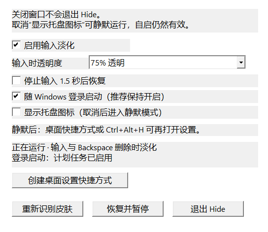

# 下载与使用 Hide

当前版本：v1.1.0，Windows 10／11 x64。

## 直接下载

1. 在浏览器点击 [下载 Hide-windows-x64.zip](https://github.com/DeriitoMe/Hide/releases/download/v1.1.0/Hide-windows-x64.zip)。
2. 右键压缩包 → **全部解压**，选择普通可写目录，例如 D:\Apps。
3. 打开 Hide 文件夹，双击 **Hide.exe**。首次显示设置引导和原托盘图标。
4. 新安装默认开启 **随 Windows 登录启动**；检查设置中的真实状态。关闭设置窗口后继续运行。以后双击程序或 **Open-Settings.cmd／设置.cmd**即可再打开设置。
5. 在文本框输入，默认指针变为 75% 透明；移动、点击、滚动或停止输入约 1.5 秒后恢复。

不需要 Codex、GitHub 客户端、Python、.NET 或鼠标驱动。Hide 使用你已经安装的系统鼠标皮肤。解压后请保留脚本和 Hide.ico。

## 从 GitHub 页面下载

打开 [发布页](https://github.com/DeriitoMe/Hide/releases/tag/v1.1.0)，展开 **Assets**，选择 **Hide-windows-x64.zip**。

**Source code (zip)** 和 **Source code (tar.gz)** 是开发者源码；便携可执行文件在上述 Hide-windows-x64.zip 中。

## 换皮肤与设置

在 Windows 鼠标属性 → 指针中选择新方案并点击 **应用**。Hide 会自动识别新方案，准备时保持正常外观，随后输入时淡化新方案，恢复时也显示新方案。

只更换文本选择等部分角色或使用混合方案，也会重新识别。必要时打开设置 → **重新识别皮肤**。

设置可选 50%、75%、90% 透明或完全隐藏、启用／暂停、空闲恢复和登录启动。新安装默认开启自启；升级保留原偏好。如需每个应用的检测选项，保留托盘，将目标软件置于前台，再右键托盘选 **当前应用：使用键盘检测**；**当前应用：自动识别**可清除例外。

### 选择静默运行

保持 **随 Windows 登录启动**勾选，取消 **显示托盘图标**。Hide 自动创建 **Hide 设置**桌面快捷方式，隐藏托盘后仍能淡化指针，下一次登录也保留静默选择。关闭设置窗口即可。

以后双击桌面入口或按 **Ctrl+Alt+H** 打开设置；也可双击 Hide.exe、Open-Settings.cmd／设置.cmd。需要图标时重新勾选即可。设置中的 **创建桌面设置快捷方式**可手动创建／更新入口，保留原 Hide 图标。

**关闭设置窗口、隐藏托盘和退出程序是不同操作。** 只有 **退出 Hide**停止本次运行；它会暂停本次会话的健康检查，下次登录仍启动。取消自启才会取消后续自动运行。

截图为已取消显示托盘的示例；首次启动该项默认勾选。

Backspace／Ctrl+Backspace 删除也会使用当前透明度，默认 75%，连续删除保持淡化。Hide 启用期间临时关闭 Windows 的“在打字时隐藏指针”，避免系统将指针完全隐藏；暂停、退出或异常恢复时恢复此前状态，不修改永久偏好。

### 开机启动

打开设置 → 勾选 **随 Windows 登录启动**。优先使用当前用户的 Windows 计划任务，登录后约 10 秒启动。现有守护兼任监督进程，异常时先恢复，再最多重启主程序 3 次；Windows 每分钟的健康检查负责监督进程也退出的情况。正常退出会暂停健康检查，下次登录或明确启动后恢复。任务采用当前用户权限，不设置运行时长上限，也不因电池供电而停止。任务登记不可用且没有现有任务时使用传统启动项后备；设置中显示实际渠道。

取消勾选即可关闭。正常退出不会被当成失败重启。不要在勾选后移动程序文件夹；移动后，在新位置重新开启即可更新路径。也可运行 Hide.exe --enable-startup／--disable-startup。若 Windows 中的任务被手动禁用，Hide 不会自行重新启用。

### 指针外观与配置不一致

如果实际显示的皮肤与配置路径不一致，Hide 会暂停淡化并保留当前可见皮肤，避免输入时换成另一套。请在 Windows 鼠标属性中重新选择希望使用的方案、点击应用，再使用 **重新识别当前皮肤**。Hide 不会替你选择其他命名方案。

## 恢复、升级与卸载

- **Ctrl+Alt+F12**：立即恢复并暂停；使用托盘菜单重新启用。
- 设置中的 **退出 Hide**，或可选托盘中的 **退出并恢复皮肤**：正常退出主程序与守护进程。关闭设置窗口只关闭界面。
- **Recover-Cursor.cmd／恢复鼠标.cmd**：异常时恢复。
- 升级前退出旧版，再解压新版或替换程序。可保留 state/settings.ini 中的设置。
- 移动或删除文件夹前正常退出；卸载前取消已启用的开机启动。

新版自动使用当前实际生效的指针配置。如果升级前方案名称和实际角色已不一致，请在 Windows 鼠标属性里重新应用希望使用的方案一次。

## 校验与常见问题

同一发布页可下载 SHA256SUMS.txt。在下载目录的 PowerShell 中执行：

~~~powershell
Get-FileHash .\Hide-windows-x64.zip -Algorithm SHA256
~~~

输出 Hash 应与校验文件相同。本次可执行文件没有代码签名。

**某套皮肤无法淡化？** 常见 CUR／ANI 受到支持；复杂彩色反色、特殊压缩、超过限制或来源不完整的动画可能受限。Hide 会保留正常外观，可以尝试完全隐藏或换方案后重新识别。

**某个软件无法淡化？** 确认托盘已启用，再尝试该应用的键盘检测。自绘光标、某些游戏、管理员窗口与受保护桌面可能不兼容。

**图标不见了？** 如果选择了静默，属于正常现象；也请展开 Windows 的隐藏托盘图标区域。双击桌面入口或 Hide.exe 查看运行和自启状态，需要图标时勾选 **显示托盘图标**。

**登录后没有效果？** 登录启动有约 10 秒准备时间。打开设置检查“启用输入淡化”、启动登记及皮肤状态。移动了程序文件夹时重新开启自启；不要删除已登记的程序。无法登记时界面会显示失败或传统启动项后备，不会把失败显示为成功。

**要提交问题？** 在 [Issues](https://github.com/DeriitoMe/Hide/issues) 提供系统、皮肤、应用及步骤。state/lifecycle.log 不包含输入文字；分享前检查个人信息。

[v1.1.0 验证报告](QUIET-VALIDATION.md)列出实际覆盖及尚待验证的部分。
